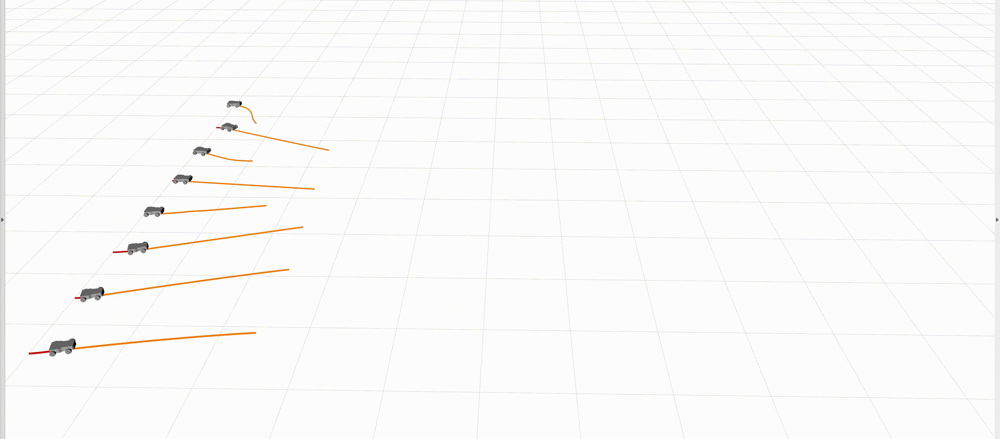

# ASAP: Asynchronous Spatial Allocation Protocol for Heterogeneous Multi-Agent Trajectory Planning

## Function

In this package, we provide a multi-agent trajectory planning method for heterogeneous system.
The inter-agent communication is based on ROS and do not any synchronization.
We achieve this by an inter-agent protocol named as **ASAP** (**A**synchronous **S**patial **A**llocation **P**rotocol).
The following figures will illustrate its performance.

16 heterogeneous agents exchange their positions

&nbsp;
<div align=center>

</div>
&nbsp;

8 Ackman cars exchang lateral positions

&nbsp;
<div align=center>

</div>
&nbsp;

## Quick Start

### Install Denpendency

1. Install ROS following https://www.ros.org/ 
2. Install some python packages:

```
pip install rospkg==1.4.0 numpy scipy
```

Here, we only support **python3**

3. Install ACADOS as this link (https://docs.acados.org/)

4. Install tmux as follows:
```
sudo apt-get install tmux
```

### General Setup

Setup the project as follows:
```
git clone https://github.com/CYDXYYJ/ASAP.git
cd ASAP
catkin_make
source deve/setup.bash
```

### Setup With Conda

If you install acados and rospkg in a specific conda enviroment, you need to uncomment the following code in `./src/planner/scripts/launch.py`.
```
os.system('tmux send-keys -t '+session_name+':0.'+str(i) +' "conda activate $conda-env-name$" C-m')
```
Additionally, the `$conda-env-name$` above should be replaced by your conda enviroment name.

### Run It

1. Open the visualization panel:
```
roslaunch visual vis.launch
```

2. Start the planner:
```
python3 src/planner/scripts/launch.py
```

3. Publish the tarets:
```
python3 src/planner/scripts/publish.py
```

## Others

### Controlled Objects

Here, we deine more than 7 kinds of controlled objects which can be found under `ASAP/src/planner/scripts/Dynamic/`
Commenly, we classify these objects into three category which are `car` for bicycle model, `unicycle` for unicycle model and `omnidirection` for omnidirectional model. 
The specific object is defined under coresponding three folder. 
For example, a mini-ackman car is defined at `ASAP/src/planner/scripts/Dynamic/Car/Mini_ack`.
